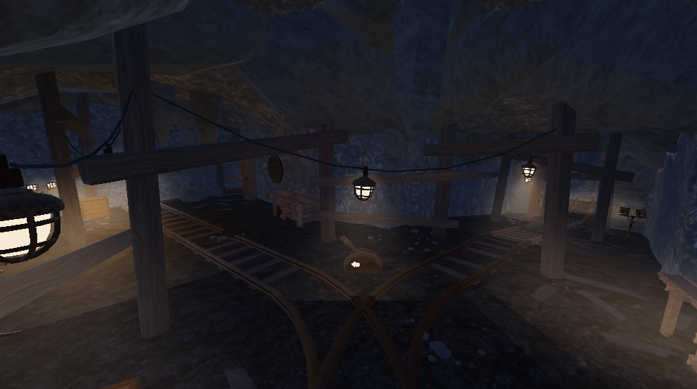

# Circles
Circles é o trabalho final para a disciplina de Tópicos Especiais em Jogos Educativos. Trata-se de um walking simulator produzido na engine Roblox Studio, onde o jogador interage com puzzles para prosseguir na sua jornada, ao mesmo tempo que busca descobrir como quebrar o ciclo. Tente. Mude. Repita. Nada nunca muda. 

</img>

## Overview

